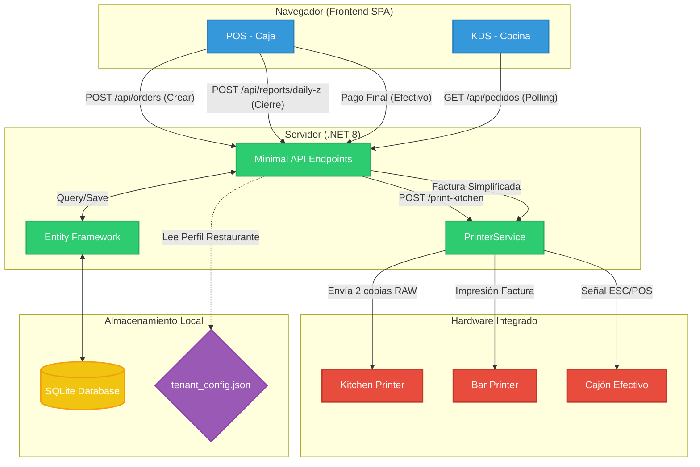

# 🌮 The Kebab Lab - TPV System

Bienvenido a la documentación oficial del sistema **The Kebab Lab TPV**. 
Esta plataforma integral (re-arquitecturada de Python a **.NET 8** y **React**) gestiona el ciclo completo de un restaurante moderno: desde la toma de pedidos interactiva hasta la impresión simultánea en barra y cocina, junto con un riguroso cierre de caja (Informe Z) y cumplimiento legal de Facturación.

---

## 🚀 1. Features Destacados

- 🎨 **White Label & Tenant Config**: Todo el sistema es dinámicamente inyectable mediante `tenant_config.json`. Logotipos, reglas de negocio (tasas de impuestos, horarios), credenciales e información de cabeceras de tickets son 100% personalizables por restaurante.
- ⚖️ **Facturación Legal (Factura Nominal y Simplificada)**: Emisión de facturas detalladas, desglosando base imponible, cuotas de IVA y control estricto de correlación en la serie de facturación.
- 🖨️ **Soporte Multi-Impresora y Auto-Impresión**: 
  - **BarPrinter**: Para recibos y facturas a cliente.
  - **KitchenPrinter**: Copias gemelas automáticas para cocina (preparación y entrega sin intervención manual del camarero).
- 💰 **Cierre de Caja Diario (Informe Z)**: Reporte estadístico contable con cierres desde las 06:00 AM y separación limpia entre "Efectivo" y "Tarjeta".
- 🧹 **Proceso Escoba Automatizado**: Los cortes de negocio son fluidos; a partir de las 06:00 AM el sistema depura y oculta las comandas del día anterior de las vistas operativas de barra y cocina.

---

## 🛠️ 2. Tech Stack

La infraestructura actual prescinde del backend en Python heredado y se asienta en tecnologías de alto rendimiento C# y JS compilado:

| Capa | Tecnología | Descripción |
| :--- | :--- | :--- |
| **Frontend (POS & KDS)** |  | **React 18 / Vite**. Implementación Single Page App con React Router. Diseño optimizado UX para pantallas táctiles con **TailwindCSS**. |
| **Backend Core API** |  | **.NET 8 (C#)**. Minimal APIs para alta concurrencia. |
| **BBDD y ORM** |  | **SQLite3** con Entity Framework Core. Ligero, transaccional y sin configuración (Zero-Conf DB). |
| **Hardware Driver** | **ESC/POS** | Control a bajo nivel (IP/TCP y USB Simulados) vía la librería .NET de ESCPOS, capaz de lanzar pulsos de cajón portamonedas (Drawer Kick). |

---

## 📊 3. Diagrama de Arquitectura

El siguiente esquema (Mermaid) muestra el flujo de vida de un pedido desde que se marca en la pantalla hasta que sale por la impresora física y se almacena:



---

## 🚀 4. Quick Start (Compilar y Ejecutar)

Si necesitas arrancar el entorno en una nueva máquina desde cero:

### 1. Variables y Archivos Vitales
Asegúrate de que cuentas con `tenant_config.json` y `kebab_lab_menu/menu_template.json` en la raíz de despliegue, junto con la carpeta de imágenes `wwwroot/products`.

### 2. Levantar el Backend
Con la CLI de .NET instalada, ejecuta en terminal:
```bash
cd KebabLab.Backend
dotnet run
```
*Esto arrancará el servidor en `http://localhost:5000` (o puerto configurado). Automáticamente creará `swiftpos.db` y se poblará la base de datos si está vacía usando tus json.*

### 3. Levantar el Frontend (Modo Dev)
```bash
cd frontend
npm install
npm run dev
```

### 4. Build de Producción (Full Bundle)
Puedes generar todos los estáticos de React y meterlos dentro del ejecutable .NET para que sirva el frontend entero desde 1 solo fichero `.exe`:
```bash
# Entrar a Frontend
cd frontend
npm run build

# Copiar el Build al Backend
xcopy /E /Y dist\* ..\KebabLab.Backend\wwwroot\

# Publicar el Backend
cd ..\KebabLab.Backend
dotnet publish -c Release -r win-x64 --self-contained -p:PublishSingleFile=true -p:PublishTrimmed=false
```
**Resultado:** Obtendrás un archivo `KebabLab.Backend.exe` en la carpeta `publish/` que, al clicarlo, enciende base de datos, API, Sistema de Impresión y Sirve React Todo-En-Uno.

---

## 📚 5. Documentación Detallada (Manuales Técnicos)

Para profundizar en el funcionamiento interno del sistema, consulta los módulos core:

1. [📖 Tenant Config y Módulo White Label](Docs/WHITE_LABEL_Y_TENANT.md)
2. [📖 Motor ESC/POS de Hardware y Simulador](Docs/SISTEMA_IMPRESION.md)
3. [📖 Cálculos, Pagos y Cierre Z Diario](Docs/FLUJO_CAJA_Y_PAGOS.md)
4. [📖 Ciclo de Vida del Pedido y Rutina de Escoba](Docs/ORDER_LIFECYCLE.md)

---

## 🌐 6. Carta Digital Pública (Frontend Cliente)

El sistema cuenta con una web pública para clientes orientada a visibilidad del catálogo (Carta Digital) altamente eficiente y accesible.

- **Arquitectura Desacoplada**: La web pública NO se conecta directamente a la base de datos (SQLite) por seguridad y rendimiento. Lee de un archivo estático `menu.json` que el panel de Admin genera y sube a Cloudflare al pulsar "Publicar Web".
- **Enfoque Mobile-First**: El diseño está pensado principalmente para lectura en móviles (escaneo de QR en mesa).
- **Sistema de Categorías (i18n)**: Menú de navegación horizontal o lateral. Utiliza los archivos `.svg` limpios de la carpeta `/categories/` superponiendo el texto traducido mediante i18n, sin texto incrustado en la imagen.
- **UI de Productos**: Diseño en "Tarjetas" (Card UI). Cajas blancas limpias que contienen la foto del producto, título, descripción corta, precio y etiquetas de "Agotado" si corresponde (leídas desde `menu.json`).
- **Multiidioma Instantáneo**: Selector de idioma visible que traduce toda la interfaz y los nombres de productos/categorías sin recargar la página.
